# vechicle_registration

## Índice

- [vechicle_registration](#vechicle_registration)
  - [Índice](#índice)
  - [Configuración](#configuración)
    - [Configuración de usuarios](#configuración-de-usuarios)
    - [Configuración de tipos de vehículos](#configuración-de-tipos-de-vehículos)
    - [Configuración de tipos de licencias](#configuración-de-tipos-de-licencias)
    - [Configuración de marcas de vehículos](#configuración-de-marcas-de-vehículos)
    - [Configuración de conductores](#configuración-de-conductores)
    - [Configuración de licencias](#configuración-de-licencias)
  - [Uso](#uso)
    - [Registro de vehículos](#registro-de-vehículos)
    - [Visualizar vechículos desde el contacto (conductor) y enviar vehículos a la API](#visualizar-vechículos-desde-el-contacto-conductor-y-enviar-vehículos-a-la-api)

Módulo para gestionar el registro de vehículos.

## Configuración

Instalar el módulo `vehicle_registration` en la instancia de Odoo.

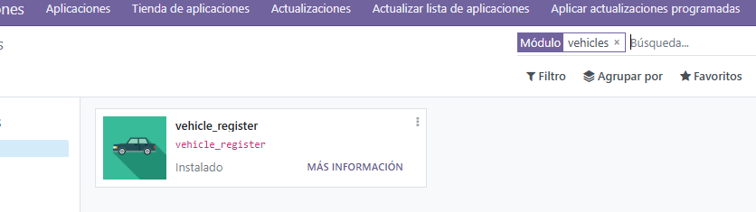

### Configuración de usuarios

Luego de instalar el módulo se debe configurar los roles de los usarios que podrán utilizarlo. Existen dos ellos:

- Usuario: Permite a los usuarios registrar vehículos.
- Administrador: Permite a los usuarios gestionar los registros de vehículos, configuraciones de vehículos y tipos de licencias, y visualizar los logs de la API.

Estos se pueden asignar a los usuarios en la configuración de usuarios:

### Configuración de tipos de vehículos

Con el perfil administrador, crear los tipos de vehículos que se pueden registrar. Para ello, ir a Registro de Vehículos > Configuración > Tipos de vehículos.

### Configuración de tipos de licencias

Con el perfil administrador, crear los tipos de licencias que se pueden registrar. Para ello, ir a Registro de Vehículos > Configuración > Tipos de licencias para Conducir.

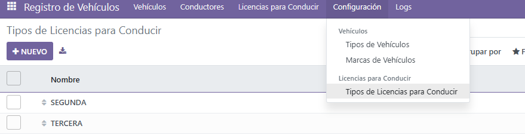

Escribir el nombre de la licencia y seleccionar el tipo de vehículo al que aplica.

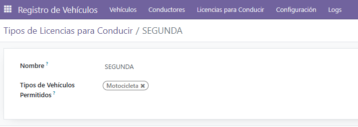

### Configuración de marcas de vehículos

Con el perfil administrador, crear las marcas de vehículos que se pueden registrar. Para ello, ir a Registro de Vehículos > Configuración > Marcas de vehículos.

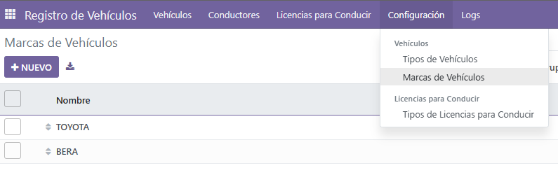

### Configuración de conductores

Con el perfil administrador, seleccionar los contactos que son conductores. Para ello, ir a Contactos y marcar la opción "Es conductor".

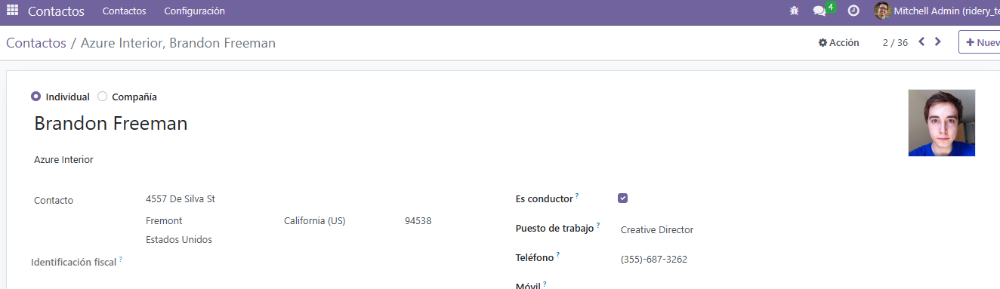

### Configuración de licencias

Con el perfil administrador, ir al menú de Licencias para Conducir y crear las licencias de los conductores.

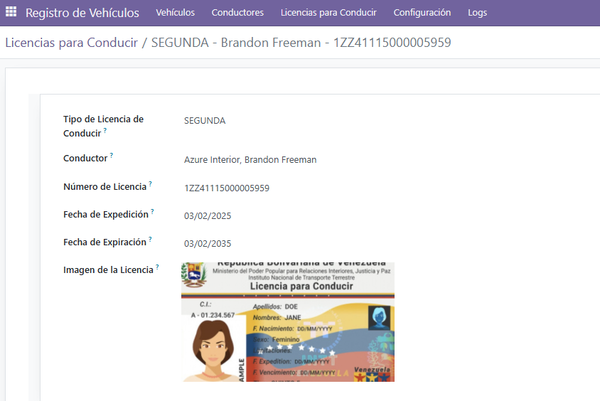

## Uso

### Registro de vehículos

con el perfil de usuario, ir a Registro de Vehículos y crear un nuevo registro. Seleccionar el conductor e introducir los datos del vehículo, así como los documentos de propiedad y de permiso de circulación.

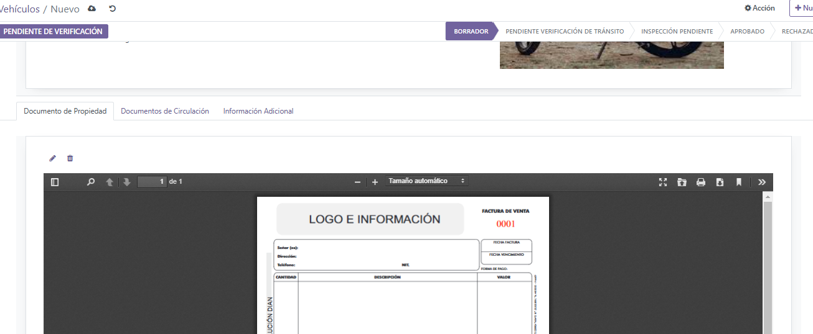

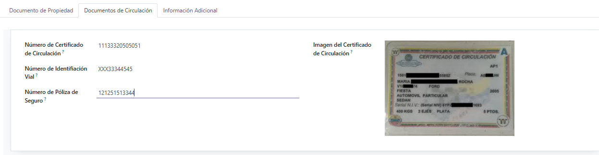

Avanzar por los estados de validación hasta llegar a la decisión de si el vehículo es apto para el registro o no.

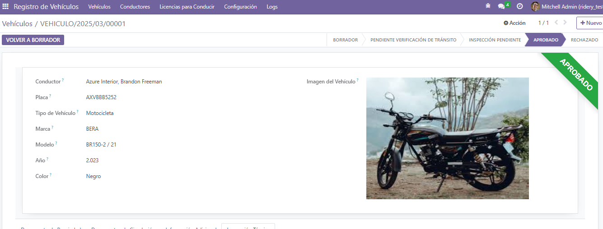

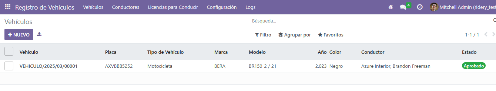

### Visualizar vechículos desde el contacto (conductor) y enviar vehículos a la API

Desde la vista formulario del conductor, se puede visualizar los vehículos que tiene registrado a través del smart button "Vehículos". El botón "Enviar Vehículos a la API" permite enviar los vehículos registrados a una API externa que consiste en un controlador en Odoo.

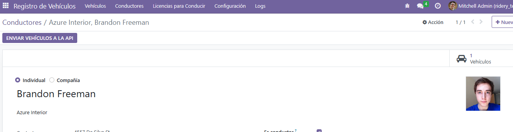

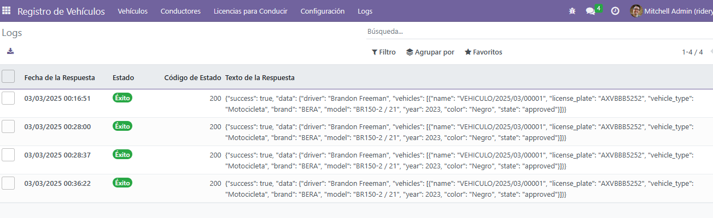
